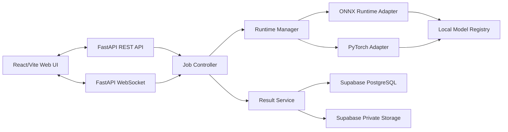

# Product Requirements Document (PRD)

## Cocoa Bean AI Inspection & Model Evaluation Platform

| รายการ | รายละเอียด |
| --- | --- |
| เวอร์ชันเอกสาร | 1.0 Draft |
| วันที่ | 28 กรกฎาคม 2026 |
| เจ้าของผลิตภัณฑ์ | Senior Project Team |
| สถานะ | รอตรวจสอบและอนุมัติ |
| โครงการเดิม | `D:\Chula\Senior_Project` |
| ขอบเขตการใช้งานระยะแรก | Local/Single-user |

## 1. บทสรุปผลิตภัณฑ์

โครงการนี้ต้องปรับปรุงจากเว็บต้นแบบหลายชุดให้เป็นแพลตฟอร์มเว็บเดียวสำหรับตรวจสอบคุณภาพเมล็ดโกโก้ ทดสอบโมเดล และจัดเก็บผลการทดลองอย่างตรวจสอบย้อนหลังได้ ระบบใหม่ต้องรองรับโมเดลทั้ง PTH และ ONNX บน CPU และ GPU ผ่านหน้าเว็บเดียว โดยใช้ YOLO สำหรับตรวจหาตำแหน่งเมล็ด และใช้ ConvNeXt แยกสองงาน ได้แก่ การจำแนกสีและการจำแนกตำหนิ

ระบบต้องรองรับการวิเคราะห์ภาพนิ่ง กล้องสด การอัปโหลดและตรวจสอบ ONNX weight การทำ Benchmark แยกชุดข้อมูล Color และ Defect การเปรียบเทียบโมเดล และการจัดเก็บประวัติผ่าน Supabase โดยเก็บเฉพาะภาพผลลัพธ์ที่ตีกรอบแล้วและไฟล์รายงาน ไม่เก็บภาพต้นฉบับใน Supabase

ผลิตภัณฑ์ระยะแรกออกแบบสำหรับผู้ใช้งานหนึ่งคน ไม่ต้องมีหน้า Login แต่ต้องวางโครงสร้างข้อมูลและสิทธิ์ให้สามารถเพิ่ม Supabase Auth และ multi-user ได้ในอนาคต

## 2. ปัญหาของระบบปัจจุบัน

### 2.1 ปัญหาด้านผลิตภัณฑ์

- มีเว็บและ backend หลายชุด ได้แก่ Flask/ONNX, Flask/PTH, Flask รุ่นเก่า และ FastAPI/React โดยไม่มีเวอร์ชันหลักที่ประกาศชัดเจน
- หน้าเว็บแสดงตัวเลือกบางอย่างที่ backend ไม่ได้ใช้งานจริง เช่น YOLO-only แต่ pipeline ยังคงบังคับใช้ Combo mode
- ไม่มีหน้าเว็บสำหรับตรวจสอบ ONNX weight ใหม่ก่อนนำเข้าสู่ pipeline
- ไม่มีประวัติผลวิเคราะห์และรายงานที่เป็นระบบ
- ผู้ใช้ไม่สามารถตรวจสอบได้อย่างชัดเจนว่าผลลัพธ์ใช้โมเดล รุ่นไฟล์ อุปกรณ์ และ execution provider ใด

### 2.2 ปัญหาด้านความถูกต้อง

- Benchmark engine ใช้ตัวแปรและข้อมูลจับคู่ที่ไม่ถูกต้อง ทำให้ metrics และภาพผลลัพธ์ไม่น่าเชื่อถือ
- Pipeline เดิมอาจนับหลายคลาสต่อเมล็ด ทั้งที่ข้อกำหนดคือหนึ่งเมล็ดต่อหนึ่งคลาสในแต่ละงาน
- เกณฑ์เกรดถูกเขียนซ้ำระหว่าง backend และ UI และอาจแสดงไม่ตรงกัน
- Color และ Defect annotations เป็นคนละชุดข้อมูล แต่หน้า Benchmark เดิมพยายามรองรับการประเมินร่วมกัน

### 2.3 ปัญหาด้านสถาปัตยกรรม

- ใช้ global state และ background thread โดยไม่มี job identity
- ใช้ MJPEG และ polling ทุก 200 ms สำหรับข้อมูล live
- server เปิดกล้องผ่าน OpenCV ทำให้กล้องต้องเชื่อมต่อกับเครื่อง server
- โหลดโมเดลตั้งแต่ import และจับ error แบบกว้าง ทำให้บางกรณีเว็บเริ่มได้แต่โมเดลไม่พร้อมใช้งาน
- ผูก model paths กับ absolute path ของเครื่องปัจจุบัน
- ไม่มี runtime manifest, dependency lock และ health diagnostics ที่เป็นทางการ

### 2.4 ปัญหาด้านการส่งมอบ

- ไม่มี README หลักสำหรับระบบที่ต้องใช้งานจริง
- ไม่มี dependency manifest สำหรับ pipeline หลัก
- ไม่มี `.gitignore` ระดับโครงการ
- repository ยังไม่มี baseline commit
- virtual environments, model weights, datasets และ archives อยู่รวมกับ source code

## 3. วิสัยทัศน์ผลิตภัณฑ์

สร้างแพลตฟอร์มเว็บแบบ local-first ที่ช่วยให้ผู้ใช้สามารถ:

1. วิเคราะห์เมล็ดโกโก้จากภาพหรือกล้องผ่าน pipeline เดียว
2. เลือก PTH/ONNX และ CPU/GPU ได้อย่างโปร่งใส
3. ทดสอบ ONNX weight ใหม่โดยไม่กระทบโมเดลหลัก
4. วัด accuracy และ performance ด้วย Benchmark ที่ตรวจสอบได้
5. เปรียบเทียบผล PTH กับ ONNX บนเงื่อนไขเดียวกัน
6. จัดเก็บประวัติและรายงานบน Supabase เพื่อดูย้อนหลังและส่งต่อผลการทดลองได้

## 4. เป้าหมาย

### 4.1 เป้าหมายหลัก

- รวม pipeline เป็นระบบหลักเพียงหนึ่งชุด
- รองรับ PTH และ ONNX ทั้ง Detector, Color Classifier และ Defect Classifier
- รองรับ CPU และ NVIDIA GPU พร้อมตรวจ runtime จริง
- บังคับให้ Color และ Defect เป็น single-label ต่อเมล็ด
- แก้ Benchmark ให้คำนวณ metrics ถูกต้องและมี automated tests
- เพิ่ม ONNX Model Lab สำหรับ validate, smoke test และ benchmark candidate weight
- จัดเก็บประวัติและรายงานผ่าน Supabase PostgreSQL และ private Storage
- ทำให้โครงการติดตั้งและรันซ้ำบนเครื่องอื่นได้

### 4.2 ตัวชี้วัดความสำเร็จ

- ผู้ใช้เปลี่ยน PTH/ONNX และ CPU/GPU ได้จาก UI โดยผลลัพธ์ระบุ runtime จริง
- หนึ่งเมล็ดมี Color หนึ่งคลาสและ Defect หนึ่งคลาสเท่านั้น
- Benchmark test cases สำหรับ TP, FP, FN และ Wrong Class ผ่านทั้งหมด
- ONNX candidate ที่ contract ไม่ถูกต้องถูกปฏิเสธก่อน activate
- ผลวิเคราะห์ที่สำเร็จถูกบันทึกใน Supabase พร้อมภาพตีกรอบและรายงาน
- สามารถระบุ model hash, dataset hash, runtime และ grade standard version ของผลย้อนหลังได้
- source code ผ่าน static checks, backend tests และ frontend lint/build

## 5. Non-goals ของ MVP

- ระบบ Login และ multi-user
- Role-based access control ระดับผู้ใช้ปลายทาง
- Cloud inference หรือ auto-scaling
- Distributed job queue เช่น Celery/Redis
- Auto-training หรือ auto-retraining
- Annotation editor บนเว็บ
- TensorRT เป็น runtime หลัก
- WebRTC streaming เต็มรูปแบบ
- การเก็บภาพต้นฉบับใน Supabase
- การรองรับ ONNX model ทุกชนิดโดยไม่มี task contract

## 6. ผู้ใช้งานเป้าหมาย

### Primary user

นักศึกษา/นักวิจัยผู้ดูแลโครงการหนึ่งคน ซึ่งต้องวิเคราะห์ตัวอย่าง ทดสอบ weight และจัดทำผลเปรียบเทียบโมเดล

### Future users

- อาจารย์หรือผู้ประเมินที่ต้องเปิดดูรายงาน
- สมาชิกทีมหลายคนที่ต้องเห็นเฉพาะข้อมูลของตน
- ผู้ใช้งานภาคสนามที่ส่งภาพจากอุปกรณ์อื่น

Future users ไม่อยู่ใน MVP แต่ schema ต้องรองรับการเพิ่ม `user_id` และ Supabase Auth ภายหลัง

## 7. Product Scope

### 7.1 Functional areas

1. Dashboard และ System Status
2. Image Analysis
3. Live Camera Analysis
4. ONNX Model Lab
5. Benchmark & Model Comparison
6. Models & Runtime Management
7. History & Reports ผ่าน Supabase

### 7.2 Pipeline หลัก

```text
Input image/frame
  → YOLO detector
  → bean bounding boxes
  → crop แต่ละเมล็ด
  → shared preprocessing
  → Color classifier: top-1 class
  → Defect classifier: top-1 class
  → counts and percentages
  → grade calculation
  → annotated result and report
```

## 8. เกณฑ์การให้เกรด

### 8.1 นิยามตัวแปร

- `N` = จำนวนเมล็ดที่ Color และ Defect classification สำเร็จครบทั้งสองงาน
- `M` = จำนวนเมล็ดขึ้นรา (Moldy)
- `P` = จำนวนเมล็ดสีม่วง (Purple)
- `S` = จำนวนเมล็ด Slaty
- `G` = จำนวนเมล็ดงอก (Sprouted)

```text
c1 = (M / N) × 100
c2 = ((P + S) / N) × 100
c3 = (G / N) × 100
```

### 8.2 เกณฑ์ปัจจุบันสำหรับตรวจสอบ

| เกรด | ขึ้นรา `c1` | ม่วง + Slaty `c2` | งอก `c3` |
| --- | ---: | ---: | ---: |
| พิเศษ | ≤ 3% | ≤ 3% | ≤ 2.5% |
| ชั้น 1 | ≤ 3% | ≤ 5% | ≤ 3% |
| ชั้น 2 | ≤ 4% | ≤ 8% | ≤ 5% |
| ตกเกรด | มากกว่าเกณฑ์ชั้น 2อย่างน้อยหนึ่งข้อ | | |

เงื่อนไขทั้งหมดในแถวเดียวกันต้องผ่านพร้อมกัน และระบบตรวจจากเกรดสูงสุดลงมา

### 8.3 กติกาความสมบูรณ์ของผล

- หาก `N = 0` ให้แสดง “ไม่สามารถประเมินเกรดได้”
- หากตรวจพบเมล็ดแต่ classify ไม่สำเร็จอย่างน้อยหนึ่งเมล็ด ให้สถานะผลเป็น `incomplete`
- ผล `incomplete` อาจแสดง provisional grade แต่ต้องไม่ระบุเป็นผลอย่างเป็นทางการ
- ทุกผลต้องบันทึก `grade_standard_version`
- Grade rules ต้องมาจาก backend config กลาง ไม่ hard-code ซ้ำใน frontend

### 8.4 ประเด็นรออนุมัติ

- ยืนยันว่า `c2` ต้องรวม Purple และ Slaty จริง
- ยืนยันว่า `N` คือจำนวนเมล็ดที่จำแนกสำเร็จครบทั้ง Color และ Defect

## 9. สถาปัตยกรรมเป้าหมาย



### 9.1 Technology decisions

| ส่วน | เทคโนโลยี | เหตุผล |
| --- | --- | --- |
| Backend API | FastAPI | Typed API, lifecycle hooks, WebSocket และ testability |
| Frontend | React + Vite | UI หลายหน้า, interactive model lab และ charts |
| Live transport | WebSocket | ส่ง frame/progress/result แบบสองทางโดยไม่ polling |
| Camera access | Browser `getUserMedia()` | กล้องอยู่ฝั่งผู้ใช้ ไม่ผูกกับเครื่อง server |
| PTH runtime | PyTorch | ใช้ weight เดิมและรองรับ CUDA |
| ONNX runtime | ONNX Runtime | กำหนด CPU/CUDA providers ได้ชัดเจน |
| Metadata/history | Supabase PostgreSQL | Query, report history และรองรับ Auth ในอนาคต |
| Artifacts | Supabase private Storage | เก็บภาพตีกรอบและรายงานโดยไม่เปิด public |
| Offline retry | Local outbox | ป้องกันผลสูญหายเมื่อ Supabase ใช้งานไม่ได้ |

### 9.2 ข้อกำหนด Job Controller

- อนุญาต inference job ครั้งละหนึ่งงานใน MVP
- ทุกงานมี UUID และ generation ID
- ผลจากงานเก่าห้ามเขียนทับงานใหม่
- Live queue ใช้แนวคิด latest-frame-wins และทิ้ง frame เก่า
- การสลับ model/backend/device ต้องรอให้งานเดิมหยุดหรือ invalidate ผลเดิม
- UI ต้องแสดงสถานะ `idle`, `loading`, `ready`, `processing`, `failed`

### 9.3 ข้อกำหนด Runtime Manager

- รองรับ `format = pth | onnx`
- รองรับ `device_requested = auto | cpu | gpu`
- รายงาน `device_actual` และ `execution_provider` จาก runtime จริง
- Lazy-load โมเดลชุดที่ active เท่านั้น
- โหลดและ warm-up ชุดใหม่ให้สำเร็จก่อนเปลี่ยน active bundle
- หากโหลดล้มเหลว ให้คงโมเดลเดิมไว้
- รองรับ unload และคืน RAM/VRAM
- เก็บ model hash และ model metadata ทุกครั้งที่ activate

### 9.4 Runtime matrix

| Format | CPU | GPU |
| --- | --- | --- |
| PTH | PyTorch CPU | PyTorch CUDA |
| ONNX | CPUExecutionProvider | CUDAExecutionProvider |

- `Auto` เลือก GPU เมื่อ runtime และ hardware พร้อม ไม่เช่นนั้นใช้ CPU
- หากผู้ใช้บังคับ `GPU` แต่ไม่พร้อม ระบบต้องตอบ error ไม่ fallback เงียบ
- TensorRT เป็น future optimization หลัง CUDA EP ผ่าน parity/benchmark

## 10. Model Contract

### 10.1 Detector

- Role: ตรวจตำแหน่งเมล็ด
- รองรับ PTH และ ONNX export profile ที่ระบบรู้จัก
- ต้องคืน bbox ในพิกัดภาพต้นฉบับ, confidence และ detector class
- YOLO-only ไม่ใช้คำนวณสี ตำหนิ หรือเกรด

### 10.2 Color Classifier

- Input: `[N, 3, 224, 224]`
- Output: `[N, 2]`
- Classes: Purple, Brown
- ผลต่อเมล็ด: top-1 หนึ่งคลาสพร้อม softmax confidence

### 10.3 Defect Classifier

- Input: `[N, 3, 224, 224]`
- Output: `[N, 4]`
- Classes: Normal, Sprouted, Slaty, Moldy
- ผลต่อเมล็ด: top-1 หนึ่งคลาสพร้อม softmax confidence

### 10.4 Shared preprocessing

- PTH และ ONNX ต้องใช้ RGB conversion, resize, normalization และ tensor layout เดียวกัน
- เริ่มจาก FP32 เพื่อทำ parity test
- เปิด PTH AMP/FP16 หรือ ONNX FP16 หลังผล top-1 และ confidence อยู่ใน tolerance ที่อนุมัติ

## 11. Functional Requirements

### FR-001 Dashboard

- แสดง active model bundle
- แสดง model format, requested device, actual device และ execution provider
- แสดงสถานะ Detector, Color, Defect และ Supabase
- แสดงผลวิเคราะห์และ Benchmark ล่าสุด
- มี quick actions ไปยังแต่ละหน้าหลัก

### FR-002 Image Analysis

- รองรับ drag-and-drop และ file picker
- รองรับ JPG, JPEG, PNG และ WebP ตามขนาดที่กำหนด
- เลือก model bundle และ device
- ปรับ YOLO confidence และ IoU
- แสดง bbox และผล Color/Defect ต่อเมล็ด
- แสดง counts, percentages, grade, runtime และ timing
- ดาวน์โหลด annotated image, JSON และ CSV
- เลือกบันทึกผลเข้า Supabase

### FR-003 Live Camera

- เปิดกล้องผ่าน browser permission
- เลือก camera device และ resolution
- ตั้ง target inference FPS
- Start, Pause และ Stop
- แสดง latency, processed FPS และ dropped frames
- วาด bbox ผ่าน Canvas overlay
- บันทึกเฉพาะ snapshot ที่ผู้ใช้กดยืนยัน
- คำนวณและบันทึกเกรดจาก snapshot ไม่ใช่ทุก live frame

### FR-004 ONNX Model Lab

- อัปโหลดไฟล์ `.onnx`
- คำนวณ SHA-256
- แสดง IR version, opset, inputs, outputs, shapes, dtypes และ metadata
- ใช้ ONNX checker และ shape inference
- สร้าง InferenceSession ด้วย provider ที่เลือก
- ทำ smoke test
- ให้ผู้ใช้ระบุ role: Detector, Color หรือ Defect
- ตรวจ task contract ก่อน pipeline test
- ทดสอบกับภาพหนึ่งภาพ
- Benchmark กับ dataset ที่ตรงกับ role
- เปรียบเทียบ candidate กับ active model
- Activate candidate แบบชั่วคราวใน session
- บันทึกเป็น model profile เมื่อผู้ใช้ยืนยัน
- ห้ามแทนที่ active model อัตโนมัติ

### FR-005 Benchmark

- แยก Color dataset และ Defect dataset เป็นคนละ workflow
- มี Detector-only benchmark แยกต่างหาก
- ไม่รวม labels จากคนละชุดเป็น end-to-end grade dataset
- รองรับ PTH/ONNX และ CPU/GPU
- รองรับ candidate ONNX จาก Model Lab
- แสดง Precision, Recall, F1, AP/mAP และ support
- แสดง confusion matrix
- แสดง FP, FN และ Wrong Class gallery
- แสดง latency mean, median, p95 และ FPS
- Export JSON, CSV และ HTML/PDF report
- บันทึก metrics และ report เข้า Supabase

### FR-006 Model Comparison

- เปรียบเทียบ PTH กับ ONNX เมื่อใช้ dataset hash และ config เดียวกัน
- เปรียบเทียบ accuracy, latency, memory และ class disagreement
- เตือนเมื่อเงื่อนไขทดลองไม่เหมือนกัน
- รองรับ parity test บน crop ชุดเดียวกัน

### FR-007 Models & Runtime

- แสดง model registry และ active bundle
- แสดง hash, path, role, format, architecture และ contract
- แสดง PyTorch/CUDA และ ONNX providers
- แสดง GPU name และ memory หากมี
- มีปุ่ม Validate, Warm-up, Activate และ Unload
- แสดง grade rule configuration และ version

### FR-008 History

- อ่านผลย้อนหลังจาก Supabase
- Filter ตามวันที่, source, format, device, provider, grade และ status
- แสดงภาพตีกรอบและผลรายเมล็ด
- แสดง model hashes และ grade standard version
- แสดง timing และ configuration ที่ใช้
- ดาวน์โหลด report/artifacts ผ่าน signed URL
- ลบ record และ artifacts ผ่าน backend

### FR-009 Reports

- แยก Analysis Reports และ Benchmark Reports
- เปรียบเทียบ Benchmark runs ที่ใช้ dataset/config เดียวกัน
- Export CSV, JSON, HTML และ PDF ตามขอบเขตที่รองรับ
- แสดงสถานะการ sync กับ Supabase

## 12. Supabase Requirements

### 12.1 Project setup

เนื่องจากยังไม่มี Supabase project งาน implementation ต้องจัดเตรียม:

- คู่มือสร้าง Supabase project
- SQL migrations แบบ version-controlled
- Environment variable template
- Bucket creation instructions หรือ migration script ที่รองรับ
- RLS policies
- Seed/config ที่ไม่包含 secrets

### 12.2 Database tables

MVP ต้องมีอย่างน้อย:

- `model_profiles`
- `analysis_runs`
- `bean_detections`
- `benchmark_runs`
- `benchmark_class_metrics`

### 12.3 Private Storage buckets

- `cocoa-results` สำหรับภาพตีกรอบและ thumbnails
- `cocoa-reports` สำหรับรายงาน
- `cocoa-benchmark-artifacts` สำหรับ confusion matrix และ error gallery

ไม่สร้าง `cocoa-inputs` ใน MVP เพราะผู้ใช้กำหนดว่าไม่เก็บภาพต้นฉบับ

### 12.4 Security model

- React ห้ามมี service-role key
- FastAPI เป็นผู้ติดต่อ Supabase ด้วย secret จาก `.env`
- ตารางใน exposed schema ต้องเปิด RLS
- ปิด direct access สำหรับ `anon` ใน MVP
- Storage buckets เป็น private
- การดาวน์โหลดใช้ signed URL อายุสั้น
- ห้าม log secrets และห้าม commit `.env`

### 12.5 Persistence workflow

1. สร้าง run record ด้วยสถานะ `processing`
2. ประมวลผล inference/benchmark
3. อัปโหลด annotated artifacts และ report
4. บันทึก detections/metrics
5. อัปเดตสถานะเป็น `completed`
6. หากล้มเหลว อัปเดตเป็น `failed` พร้อม sanitized error

ทุกงานต้องใช้ UUID และ idempotency key เพื่อ retry โดยไม่สร้างข้อมูลซ้ำ

### 12.6 Offline outbox

- เมื่อ Supabase ใช้งานไม่ได้ ให้เก็บ metadata และ artifacts ที่รอ sync ใน local outbox
- UI แสดง `pending_sync`
- มีคำสั่งหรือ background retry สำหรับส่งข้อมูลภายหลัง
- ห้ามทำให้ inference ล้มเหลวเพียงเพราะ Supabase ใช้งานไม่ได้

## 13. Supabase Data Model

### 13.1 `model_profiles`

ฟิลด์หลัก: `id`, `name`, `role`, `format`, `sha256`, `file_name`, `architecture`, `input_shape`, `output_shape`, `class_names`, `opset_version`, `created_at`

### 13.2 `analysis_runs`

ฟิลด์หลัก: `id`, `created_at`, `source_type`, `status`, `backend`, `device_requested`, `device_actual`, `execution_provider`, model foreign keys, `annotated_image_path`, `grade`, `grade_standard_version`, percentages, totals, `class_counts`, `timing`, `configuration`, `error_message`

### 13.3 `bean_detections`

ฟิลด์หลัก: `id`, `analysis_run_id`, `bean_index`, `bbox`, detector confidence, color result/confidence, defect result/confidence และ `classification_status`

### 13.4 `benchmark_runs`

ฟิลด์หลัก: `id`, `created_at`, `task`, `status`, model/runtime information, `dataset_name`, `dataset_hash`, `dataset_summary`, `configuration`, `summary_metrics`, `confusion_matrix`, `timing_metrics`, report/artifact paths และ error

### 13.5 `benchmark_class_metrics`

ฟิลด์หลัก: `benchmark_run_id`, class information, `tp`, `fp`, `fn`, `precision`, `recall`, `f1`, `ap`, `support`

## 14. Non-functional Requirements

### NFR-001 Correctness

- PTH และ ONNX ต้องผ่าน parity test ตาม tolerance ที่กำหนด
- Grade calculation ต้องมี unit tests ครบทุก boundary
- Benchmark metrics ต้องตรวจเทียบกับ test fixtures ที่คำนวณผลไว้ล่วงหน้า

### NFR-002 Reproducibility

- ทุก run เก็บ model hash, dataset hash, config และ runtime information
- model paths ใช้ relative path หรือ environment configuration
- dependencies ต้อง pin version

### NFR-003 Performance

- UI ต้องไม่ค้างระหว่าง inference
- Live pipeline ต้องทิ้ง stale frames แทนการสะสม queue
- แสดง warm-up time แยกจาก steady-state latency
- CPU อาจ parallel Color/Defect หลัง benchmark ยืนยัน
- GPU เริ่มแบบ sequential และเปิด parallel เฉพาะเมื่อวัดแล้วดีกว่า

### NFR-004 Reliability

- model switch ต้องเป็น transactional
- Supabase failure ต้องไม่ทำให้ผล inference สูญหาย
- error ต้องแสดงต่อผู้ใช้และบันทึกแบบไม่เปิดเผย secret/path ที่ไม่จำเป็น

### NFR-005 Security

- ตรวจ MIME, extension และ file signature
- จำกัดขนาด image, ONNX และ ZIP upload
- ป้องกัน ZIP path traversal และ decompression bomb
- เก็บ uploaded model ใน non-public temporary directory
- ใช้ signed URLs สำหรับ Storage

### NFR-006 Maintainability

- แยก API, runtime adapters, pipeline, grading, benchmark, persistence และ UI
- ห้ามมี business logic สำคัญใน route handler
- มี type hints และ Pydantic schemas สำหรับ API contracts

## 15. API Surface ระดับสูง

### System and runtime

- `GET /api/health`
- `GET /api/runtime/capabilities`
- `GET /api/runtime/active`
- `POST /api/runtime/activate`
- `POST /api/runtime/unload`

### Analysis

- `POST /api/analysis/image`
- `GET /api/analysis/{run_id}`
- `WS /ws/live-analysis`

### Model Lab

- `POST /api/models/onnx/inspect`
- `POST /api/models/onnx/smoke-test`
- `POST /api/models/onnx/pipeline-test`
- `POST /api/models/{model_id}/activate`

### Benchmark

- `POST /api/benchmarks`
- `GET /api/benchmarks/{run_id}`
- `GET /api/benchmarks/{run_id}/report`
- `POST /api/benchmarks/compare`

### History

- `GET /api/history/analysis`
- `GET /api/history/benchmarks`
- `DELETE /api/history/{type}/{run_id}`
- `POST /api/history/sync-pending`

## 16. UX Requirements

- ทุกหน้าต้องแสดง active format/device/provider ในตำแหน่งที่เห็นได้ชัด
- ปิดตัวเลือก GPU เมื่อ runtime ไม่รองรับ พร้อมอธิบายเหตุผล
- ห้าม fallback จาก GPU ไป CPU แบบไม่แจ้งผู้ใช้
- แสดง progress ของ model loading, inference, benchmark และ Supabase sync
- แสดง validation errors แบบ actionable
- UI ภาษาไทยเป็นค่าเริ่มต้น และใช้ชื่อเทคนิคอังกฤษกำกับเมื่อจำเป็น
- รองรับ desktop เป็นหลัก และ responsive สำหรับ tablet

## 17. Testing Strategy

### Unit tests

- Grade boundaries
- Single-label selection
- Preprocessing parity
- IoU and matching
- TP/FP/FN/Wrong Class
- Safe ZIP extraction
- Model contract validation
- Supabase payload serialization

### Integration tests

- Image analysis ด้วย mocked runtimes
- PTH CPU smoke test
- ONNX CPU smoke test
- Runtime switch and rollback
- ONNX upload → validate → candidate test
- Benchmark dataset fixtures
- Supabase repository ด้วย test project หรือ mocked client
- Storage upload failure และ outbox retry

### Frontend tests

- Runtime selector states
- Upload validation
- Live camera permission/error states
- Model Lab workflow
- Benchmark result rendering
- History filters และ signed artifact links

### Hardware validation

- CPU-only Windows environment
- NVIDIA GPU + PyTorch CUDA
- NVIDIA GPU + ONNX Runtime CUDA EP
- เปรียบเทียบผล FP32 ก่อนเปิด mixed precision

## 18. Migration Plan

### Phase 0: Project hygiene

- สร้าง `.gitignore`
- จัด source/model/dataset/artifact directories
- สร้าง dependency manifests และ environment templates
- เก็บ legacy apps โดยไม่ลบ

### Phase 1: Core inference

- สร้าง shared preprocessing
- สร้าง PTH/ONNX adapters
- สร้าง Runtime Manager
- แก้ single-label และ grading
- เพิ่ม CPU tests

### Phase 2: Benchmark correctness

- เขียน matching engine ใหม่หรือซ่อมโดยยึด index contract
- เพิ่ม fixtures และ metrics tests
- แยก Color/Defect/Detector workflows

### Phase 3: FastAPI and React

- สร้าง typed REST contracts
- สร้าง Image Analysis และ Dashboard
- สร้าง WebSocket live flow และ browser camera
- สร้าง Models & Runtime page

### Phase 4: ONNX Model Lab

- Inspect/check/shape inference
- Smoke test และ task contracts
- Candidate model activation
- Model comparison

### Phase 5: Supabase

- ให้ผู้ใช้สร้าง Supabase project ตามคู่มือ
- รัน migrations และสร้าง private buckets
- เชื่อม backend repository
- เพิ่ม History/Reports และ local outbox

### Phase 6: GPU validation and hardening

- ติดตั้ง runtime ที่เข้ากัน
- ทดสอบ PyTorch CUDA และ ONNX CUDA EP
- เพิ่ม mixed precision หลัง parity ผ่าน
- Performance benchmark และ security checks

### Phase 7: Legacy retirement

- ยืนยัน feature parity
- ย้าย Flask/FastAPI รุ่นเก่าไป `legacy/` หรือ archive
- อัปเดต README และ system documentation

## 19. Acceptance Criteria ของ MVP

1. มีคำสั่งเดียวสำหรับเริ่ม backend และคำสั่งเดียวสำหรับ frontend
2. Image Analysis ทำงานด้วย PTH/CPU และ ONNX/CPU
3. UI แสดง actual provider/device
4. Single-label invariant ผ่าน tests
5. Grade rules ผ่าน boundary tests และผู้ใช้อนุมัติสูตร
6. Benchmark Color และ Defect ทำงานแยกกันและ metrics fixtures ผ่าน
7. ONNX Model Lab ปฏิเสธโมเดลที่ contract ไม่ตรง
8. ผู้ใช้สามารถทดสอบ candidate ONNX โดยไม่แทน active model
9. ผลสำเร็จบันทึก metadata ใน Supabase และภาพตีกรอบ/รายงานใน private Storage
10. ไม่บันทึกภาพต้นฉบับใน Supabase
11. History เปิดดูและดาวน์โหลด artifacts ด้วย signed URL ได้
12. หาก Supabase offline ผลถูกเก็บ pending และ sync ภายหลังได้
13. frontend lint/build และ backend automated tests ผ่าน
14. README มีวิธีติดตั้ง CPU, GPU, Supabase และ troubleshooting

## 20. Risks and Mitigations

| ความเสี่ยง | ผลกระทบ | แนวทางลดความเสี่ยง |
| --- | --- | --- |
| PyTorch/ONNX CUDA versions ไม่เข้ากัน | GPU ใช้งานไม่ได้ | ทำ compatibility matrix และล็อก versions |
| Candidate ONNX output ไม่ตรง contract | pipeline ให้ผลผิด | inspect + task adapter + smoke test ก่อน activate |
| PTH/ONNX preprocessing ต่างกัน | ผลเปรียบเทียบไม่ยุติธรรม | shared preprocessing และ parity tests |
| Benchmark labels เป็นคนละชุด | metrics ถูกตีความผิด | แยก Color/Defect workflows |
| Supabase ยังไม่ถูกสร้าง | History ใช้งานไม่ได้ในช่วงแรก | migration scripts, setup guide และ local outbox |
| Storage objects ไม่อยู่ใน DB backup | artifacts อาจสูญหาย | export/backup policy แยกสำหรับ Storage |
| GPU ไม่มีในเครื่องพัฒนา | ทดสอบได้เฉพาะ CPU | ทำ capability detection และ hardware validation phase |
| Scope ขยายเร็วเกินไป | ส่งมอบล่าช้า | ทำตาม phases และ acceptance criteria |

## 21. Open Decisions

1. ยืนยันสูตร `c2 = Purple + Slaty`
2. ยืนยันตัวหาร `N` ของเกณฑ์เกรด
3. กำหนดขนาดสูงสุดของ Image, ONNX และ Benchmark ZIP
4. กำหนด retention ของภาพตีกรอบและรายงานใน Supabase
5. กำหนด tolerance สำหรับ PTH/ONNX parity
6. กำหนดรูปแบบรายงานหลัก: HTML หรือ PDF
7. กำหนด NVIDIA GPU/CUDA target สำหรับ environment ที่ใช้ทดสอบจริง

## 22. เอกสารอ้างอิงทางเทคนิค

- ONNX Model Checker: https://onnx.ai/onnx/api/checker.html
- ONNX Shape Inference: https://onnx.ai/onnx/repo-docs/ShapeInference.html
- ONNX Runtime CUDA Execution Provider: https://onnxruntime.ai/docs/execution-providers/CUDA-ExecutionProvider.html
- ONNX Runtime I/O Binding: https://onnxruntime.ai/docs/performance/tune-performance/iobinding.html
- PyTorch Automatic Mixed Precision: https://docs.pytorch.org/docs/stable/amp.html
- Browser Camera `getUserMedia()`: https://developer.mozilla.org/en-US/docs/Web/API/MediaDevices/getUserMedia
- FastAPI WebSockets: https://fastapi.tiangolo.com/advanced/websockets/
- Supabase Row Level Security: https://supabase.com/docs/guides/database/postgres/row-level-security
- Supabase Storage: https://supabase.com/docs/guides/storage
- Supabase Private Assets and Signed URLs: https://supabase.com/docs/guides/storage/serving/downloads

## 23. Approval

เอกสารนี้เป็น PRD ฉบับร่าง การเริ่ม implementation ต้องได้รับการอนุมัติอย่างน้อยในหัวข้อต่อไปนี้:

- Product scope และ Non-goals
- เกณฑ์การให้เกรด
- FastAPI + React/Vite architecture
- Supabase schema และนโยบายไม่เก็บภาพต้นฉบับ
- ลำดับการส่งมอบและ acceptance criteria
