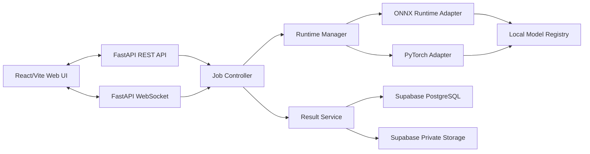

# Product Requirements Document (PRD)

## Cocoa Bean AI Inspection and Model Evaluation Platform

| Item | Description |
| --- | --- |
| Document version | 1.1 Draft |
| Date | July 28, 2026 |
| Product owner | Senior Project Team |
| Status | Pending review and approval |
| Existing project | `D:\Chula\Senior_Project` |
| Initial operating scope | Local, single-user |

## 1. Executive Summary

The project will be upgraded from several overlapping web prototypes into a single platform for cocoa bean inspection, model testing, benchmarking, and reproducible experiment reporting.

The new platform must test and operate PyTorch and ONNX model bundles independently on CPU and GPU from one web application. The inference pipeline will use YOLO to detect cocoa beans and two ConvNeXt classifiers to classify color and defects. Each detected bean must receive exactly one top-1 color class and one top-1 defect class, together with confidence values.

The product will support still-image analysis, live-camera analysis, a browser-based Model Lab with separate PyTorch and ONNX tabs, separate end-to-end Color and Defect benchmark workflows, optional PTH-versus-ONNX comparison, and experiment history stored in Supabase. Supabase will store structured metadata, annotated result images, and generated HTML reports. Original input images and benchmark datasets will not be stored in Supabase.

The MVP is designed for one local user and will not require login. However, the data model and security boundaries must allow Supabase Auth and multi-user row ownership to be added later.

## 2. Current Problems

### 2.1 Product problems

- The repository contains multiple application paths: Flask/ONNX, Flask/PTH, older Flask variants, and a separate FastAPI/React prototype.
- No application is formally identified as the canonical production path.
- Some UI controls do not represent actual backend behavior. For example, the existing benchmark accepts a YOLO-only option while the backend forces Combo mode.
- There is no browser workflow for validating a new ONNX weight before using it in the cocoa pipeline.
- Analysis and benchmark results are not stored in a structured history.
- The user cannot reliably identify the model file, model hash, device, or execution provider used for an existing result.

### 2.2 Correctness problems

- The current benchmark engine contains invalid matching state and undefined variables, so its metrics cannot be trusted.
- The current ONNX classifier path can count multiple labels for one bean, while the product requirement is single-label classification.
- Grade rules are duplicated between backend code and frontend display logic.
- Color and Defect annotations belong to separate datasets, but the current benchmark design attempts to combine the tasks.

### 2.3 Architecture problems

- Application state is stored in module-level global variables.
- Background inference does not use stable job identities, so stale jobs may overwrite newer results.
- The live UI relies on MJPEG streaming and frequent HTTP polling.
- The server opens the camera through OpenCV, requiring the camera to be connected to the server machine.
- Models are loaded during module import, and broad exception handling can leave the web server running with unavailable models.
- Model paths are hard-coded absolute Windows paths.
- There is no formal runtime manifest, pinned dependency set, or diagnostic health endpoint.

### 2.4 Delivery problems

- There is no canonical root README for the supported application.
- There is no dependency manifest for the primary pipeline.
- There is no root `.gitignore`.
- The Git repository has no baseline commit.
- Source code, model weights, virtual environments, datasets, archives, and generated artifacts are mixed in the same workspace.

## 3. Product Vision

Build a local-first web platform that enables the user to:

1. Analyze cocoa beans from an image or browser camera through one consistent pipeline.
2. Select PTH or ONNX and CPU or GPU with transparent runtime reporting.
3. Validate new PTH or ONNX weights without affecting the active model bundle.
4. Measure accuracy and performance through separate, trustworthy PTH and ONNX benchmark runs.
5. Optionally compare PTH and ONNX results under equivalent conditions.
6. Store experiment history and reports in Supabase for reproducibility and later review.

## 4. Goals

### 4.1 Primary goals

- Establish one canonical application and inference pipeline.
- Support PTH and ONNX for the Detector, Color Classifier, and Defect Classifier.
- Support CPU and NVIDIA GPU with runtime capability detection.
- Enforce one color class and one defect class per detected bean.
- Repair benchmark matching and metrics and cover them with automated tests.
- Provide a Model Lab with separate PTH and ONNX workflows for inspection, validation, smoke testing, and candidate benchmarking.
- Store history in Supabase PostgreSQL and artifacts in private Supabase Storage.
- Make the project reproducible on another machine.

### 4.2 Success metrics

- The user can select PTH or ONNX and CPU or GPU from the UI.
- Every result reports the actual device and execution provider used.
- The single-label invariant is enforced and tested.
- Benchmark fixtures for true positive, false positive, false negative, and wrong-class cases pass.
- PTH and ONNX benchmarks produce independent results using the same documented end-to-end protocol.
- An incompatible PTH or ONNX candidate is rejected before activation.
- A completed analysis is stored in Supabase with its annotated result and report.
- Historical results identify the exact model hashes, dataset hash, runtime configuration, and grade-standard version.
- PyTorch CUDA and ONNX Runtime CUDA Execution Provider workflows pass hardware validation on an NVIDIA GeForce GTX 1080 Ti.
- Backend automated tests and frontend lint/build checks pass.

## 5. MVP Non-goals

- Login and multi-user workflows
- End-user role-based access control
- Cloud inference or automatic scaling
- Distributed job queues such as Celery and Redis
- Automatic training or retraining
- A browser-based annotation editor
- TensorRT as the primary runtime
- Full WebRTC streaming
- Storing original input images in Supabase
- Supporting arbitrary ONNX graphs without a known task contract

## 6. Target Users

### 6.1 Primary user

A single student or researcher responsible for analyzing samples, testing weights, comparing runtimes, and preparing project results.

### 6.2 Future users

- Advisors or reviewers who need read-only access to reports
- Multiple team members who need ownership of their own results
- Remote field users who submit images from other devices

Future users are outside the MVP, but the schema must allow a `user_id` and Supabase Auth policies to be introduced later.

## 7. Product Scope

### 7.1 Functional areas

1. Dashboard and System Status
2. Image Analysis
3. Live Camera Analysis
4. Model Lab with separate PTH and ONNX tabs
5. Benchmark and Model Comparison
6. Models and Runtime Management
7. History and Reports through Supabase

### 7.2 Canonical inference pipeline

```text
Input image or frame
  → YOLO detector
  → bean bounding boxes
  → crop each detected bean
  → shared preprocessing
  → Color classifier: one top-1 class
  → Defect classifier: one top-1 class
  → counts and percentages
  → grade calculation
  → annotated result and report
```

## 8. Grade Standard

### 8.1 Variable definitions

- `N` = number of unique bean bounding boxes detected by YOLO after confidence filtering and non-maximum suppression
- `M` = number of Moldy beans
- `P` = number of Purple beans
- `S` = number of Slaty / Hard as rock beans
- `G` = number of Germinate beans
- `U_PS` = number of unique detected beans whose Color top-1 result is Purple or whose Defect top-1 result is Slaty / Hard as rock; a bean satisfying both conditions is counted once

```text
c1 = (M / N) × 100
c2 = (U_PS / N) × 100
c3 = (G / N) × 100
```

### 8.2 MVP grade criteria

| Grade | Moldy `c1` | Unique Purple or Slaty / Hard as rock `c2` | Germinate `c3` |
| --- | ---: | ---: | ---: |
| Special | ≤ 3% | ≤ 3% | ≤ 2.5% |
| Grade 1 | ≤ 3% | ≤ 5% | ≤ 3% |
| Grade 2 | ≤ 4% | ≤ 8% | ≤ 5% |
| Rejected | At least one value exceeds the Grade 2 threshold | | |

All conditions in a row must pass simultaneously. Evaluation proceeds from the highest grade to the lowest grade.

### 8.3 Completeness rules

- If `N = 0`, the system must return “Grade cannot be evaluated.”
- Each valid detected crop receives exactly one Color top-1 class and one Defect top-1 class together with softmax confidence.
- A low confidence value does not suppress the top-1 result.
- If a detected crop is invalid, a runtime fails, or either classifier cannot produce a finite output, the run status must be `incomplete`.
- An incomplete result may show detected-bean counts and available classifier outputs, but `grade` must be null and the system must not calculate or display a provisional grade.
- Every saved result must include a `grade_standard_version`.
- Grade rules must come from one backend configuration source and must not be duplicated in frontend code.

### 8.4 Product-owner decisions for MVP

- `N` is the number of bean bounding boxes detected by YOLO after filtering and non-maximum suppression.
- `c2` uses the unique union of Purple and Slaty / Hard as rock beans; the same bean is never counted twice.
- Both classifiers return top-1 plus confidence for every valid crop.
- Grade thresholds are evaluated using unrounded percentages; rounding is for display only.
- These rules are product-owner-approved for the MVP and do not claim external certification by a cocoa grading authority.

## 9. Target Architecture



### 9.1 Technology decisions

| Component | Technology | Rationale |
| --- | --- | --- |
| Backend API | FastAPI | Typed API contracts, lifecycle hooks, WebSockets, and testability |
| Frontend | React + Vite | Multi-page interactive UI, Model Lab, and benchmark charts |
| Live transport | WebSocket | Bidirectional frame, progress, and result delivery without polling |
| Camera access | Browser `getUserMedia()` | Camera access belongs to the browser device rather than the server |
| PTH runtime | PyTorch | Existing weight compatibility and CUDA support |
| ONNX runtime | ONNX Runtime | Explicit CPU and CUDA execution-provider selection |
| Metadata and history | Supabase PostgreSQL | Queryable experiment history with an Auth migration path |
| Artifacts | Supabase private Storage | Private annotated images and generated reports |
| Offline retry | Local outbox | Prevents result loss while Supabase is unavailable |

### 9.2 Job Controller requirements

- The MVP permits one active inference job at a time.
- Every job has a UUID and generation ID.
- A stale job must never overwrite a newer job result.
- The live queue follows a latest-frame-wins strategy and drops stale frames.
- Runtime switching must wait for the current job to stop or invalidate its output.
- The UI must expose `idle`, `loading`, `ready`, `processing`, and `failed` states.

### 9.3 Runtime Manager requirements

- Support `format = pth | onnx`.
- Support `device_requested = auto | cpu | gpu`.
- Report `device_actual` and `execution_provider` from the active runtime.
- Lazy-load only the active model bundle.
- Load and warm up a new bundle successfully before making it active.
- Preserve the existing bundle if activation fails.
- Support unload and RAM/VRAM cleanup.
- Record model hashes and metadata whenever a bundle is activated.

### 9.4 Runtime matrix

| Format | CPU | GPU |
| --- | --- | --- |
| PTH | PyTorch CPU | PyTorch CUDA |
| ONNX | CPUExecutionProvider | CUDAExecutionProvider |

- `Auto` selects GPU only when the required hardware and runtime are available; otherwise it selects CPU.
- If the user explicitly requests GPU and GPU is unavailable, the API must return an actionable error instead of silently falling back.
- The required MVP GPU validation target is NVIDIA GeForce GTX 1080 Ti.
- TensorRT is a future optimization after CUDA EP passes correctness and performance validation.

## 10. Model Contracts

### 10.1 Detector

- Purpose: detect cocoa bean locations.
- Supports recognized PyTorch `.pt` and ONNX export profiles.
- Class mapping: `0 = Cocoa bean`.
- Returns bounding boxes in original-image coordinates, detector confidence, and detector class information.
- Detector-only results cannot produce color, defect, or grade results.

### 10.2 Color Classifier

- `B` denotes runtime batch size and is not the grade denominator `N`.
- Input: `[B, 3, 224, 224]`
- Output: `[B, 2]`
- Class mapping: `0 = Purple`, `1 = Brown`
- Per-bean output: exactly one top-1 class with softmax confidence

### 10.3 Defect Classifier

- `B` denotes runtime batch size and is not the grade denominator `N`.
- Input: `[B, 3, 224, 224]`
- Output: `[B, 4]`
- Class mapping: `0 = Normal`, `1 = Germinate`, `2 = Slaty / Hard as rock`, `3 = Moldy`
- Stable internal keys: `normal`, `germinate`, `slaty_hard_as_rock`, and `moldy`
- Per-bean output: exactly one top-1 class with softmax confidence

### 10.4 Shared preprocessing

- PTH and ONNX must use the same RGB conversion, resize, normalization, and tensor layout.
- FP32 is the correctness baseline.
- PTH AMP/FP16 and ONNX FP16 are evaluated independently against their own format's FP32 baseline and may be enabled only after the applicable correctness policy is approved and passed.

## 11. Functional Requirements

### FR-001 Dashboard

- Display the active model bundle.
- Display model format, requested device, actual device, and execution provider.
- Display Detector, Color, Defect, and Supabase health.
- Display the latest analysis and benchmark results.
- Provide quick navigation to all primary workflows.

### FR-002 Image Analysis

- Support drag-and-drop and file selection.
- Support JPG, JPEG, PNG, and WebP within configured limits.
- Limit each uploaded image to 50 MB.
- Allow model-bundle and device selection.
- Allow YOLO confidence and IoU configuration.
- Display bounding boxes and per-bean Color and Defect results.
- Display counts, percentages, grade, runtime, and timing.
- Export the annotated image, JSON result, and CSV result.
- Allow the user to save a completed result to Supabase.

### FR-003 Live Camera Analysis

- Access cameras through browser permission.
- Allow camera-device and resolution selection.
- Allow target inference FPS configuration.
- Support Start, Pause, and Stop.
- Display latency, processed FPS, and dropped-frame counts.
- Draw bounding boxes using a browser Canvas overlay.
- Save only a snapshot explicitly confirmed by the user.
- Calculate and persist grades from a confirmed snapshot rather than every live frame.

### FR-004 Model Lab

The Model Lab has separate `PTH` and `ONNX` tabs. Both tabs must:

- Require the user to assign the role: Detector, Color, or Defect.
- Calculate and display SHA-256 before a candidate can be saved.
- Validate the role-specific task contract before pipeline testing.
- Test a candidate with one image through the end-to-end pipeline.
- Benchmark a candidate with a role-compatible dataset.
- Compare a candidate against the active model when experiment conditions match.
- Activate a validated candidate temporarily for the current session.
- Save a validated candidate as a model profile only after explicit confirmation.
- Never replace the active model automatically.

#### FR-004A PTH tab

- Accept recognized PyTorch formats by role: `.pt` for the YOLO Detector and `.pth` for the ConvNeXt classifiers.
- Display file information, model role, architecture, expected class map, input/output contract, and validation status.
- Load classifier state dictionaries with `weights_only=True` and instantiate only allowlisted architectures.
- Load YOLO candidates only through the supported Ultralytics model contract.
- Reject arbitrary serialized Python objects and candidates that require unknown executable code.
- Run smoke tests using PyTorch CPU or PyTorch CUDA.

#### FR-004B ONNX tab

- Accept a self-contained `.onnx` file or a ZIP bundle containing one `.onnx` graph and its relative `.onnx.data` external tensor files.
- Display IR version, opset, input/output names, shapes, data types, external-data references, and metadata.
- Run ONNX model checking and shape inference.
- Validate all external-data paths before model loading.
- Create an InferenceSession using CPUExecutionProvider or CUDAExecutionProvider as selected.
- Run a smoke test before pipeline testing or activation.

### FR-005 Benchmark

- Treat Color and Defect datasets as separate workflows.
- Provide a separate Detector-only benchmark.
- Do not combine annotations from separate datasets into a grade-validation dataset.
- Provide independent PTH and ONNX benchmark runs; neither format depends on the other format passing.
- Support PTH/ONNX and CPU/GPU, including PyTorch CUDA and ONNX Runtime CUDA EP validation on GTX 1080 Ti.
- Support an ONNX candidate loaded from Model Lab.
- Support a PTH candidate loaded from Model Lab.
- For Color and Defect end-to-end benchmarks, report per-class Precision, Recall, F1, support, macro averages, and a confusion matrix.
- For the Detector-only benchmark, report AP50 and COCO-style mAP50-95.
- Display a confusion matrix.
- Display false-positive, false-negative, and wrong-class galleries.
- Report mean, median, p95 latency, and FPS.
- Export JSON, CSV, and HTML reports. HTML is the primary MVP report format.
- Save benchmark metrics and reports to Supabase.

#### FR-005A Dataset ZIP contract

- Accept a benchmark ZIP containing `images/` and `labels/` directories.
- Each image must have a same-stem YOLO label file, for example `images/sample001.jpg` and `labels/sample001.txt`.
- Each label line uses normalized YOLO format: `<class_id> <x_center> <y_center> <width> <height>`.
- Each image is limited to 50 MB.
- The user must select the dataset task as Detector, Color, or Defect before validation.
- Detector class mapping: `0 = Cocoa bean`.
- Color class mapping: `0 = Purple`, `1 = Brown`.
- Defect class mapping: `0 = Normal`, `1 = Germinate`, `2 = Slaty / Hard as rock`, `3 = Moldy`.
- Reject duplicate paths, unsafe paths, unsupported files, invalid coordinates, out-of-range class IDs, missing image/label pairs, decompression bombs, and archives that exceed configured compressed or extracted limits.
- Display validation results, class distribution, file counts, and errors before the benchmark can start.
- Calculate a canonical dataset SHA-256 from sorted relative paths and file contents.

#### FR-005B End-to-end evaluation protocol

- Color and Defect benchmarks execute `YOLO → crop → role-specific ConvNeXt`.
- For Color and Defect end-to-end evaluation, use class-agnostic one-to-one matching by globally descending IoU at the configured threshold after detector confidence filtering and non-maximum suppression. The default IoU threshold is `0.50`.
- A matched detection with the correct class is a true positive.
- A matched detection with the wrong class contributes one false positive to the predicted class and one false negative to the ground-truth class.
- An unmatched prediction is a false positive and an unmatched ground-truth bean is a false negative.
- Store the IoU threshold, detector confidence threshold, non-maximum-suppression configuration, class map, preprocessing version, and metric implementation version with every run.
- Detector AP/mAP and end-to-end class metrics must be reported separately so detector and classifier errors are not presented as the same measurement.
- Detector mAP50-95 uses IoU thresholds from `0.50` through `0.95` in `0.05` increments and 101-point interpolated precision.
- Golden fixtures must define exact expected results for true-positive, false-positive, false-negative, duplicate-detection, and wrong-class cases.

### FR-006 Model Comparison

- PTH and ONNX runs remain valid independent benchmark results.
- Comparison is optional and is enabled only when dataset hash and experiment configuration match.
- Compare accuracy, latency, memory, and class disagreements.
- Warn when experiment conditions differ.
- Support parity testing on the same crop batch.
- Parity tolerance is a comparison diagnostic and is not the pass/fail criterion for an independent PTH or ONNX benchmark.

### FR-007 Models and Runtime

- Display the model registry and active bundle.
- Display each model's hash, path, role, format, architecture, and contract.
- Display model-bundle membership and the preprocessing and class-map versions used by the bundle.
- Display PyTorch/CUDA and ONNX provider availability.
- Display GPU name and memory when available.
- Provide Validate, Warm-up, Activate, and Unload actions.
- Display grade-rule configuration and version.

### FR-008 History

- Load historical results from Supabase.
- Filter by date, source, format, device, provider, grade, and status.
- Display the annotated image and per-bean results.
- Display model hashes and grade-standard version.
- Display timing and experiment configuration.
- Download reports and artifacts through signed URLs.
- Delete a run and its artifacts through the backend.

### FR-009 Reports

- Separate Analysis Reports and Benchmark Reports.
- Compare benchmark runs only when dataset and configuration are compatible.
- Export CSV, JSON, and HTML. HTML is the primary MVP report format; PDF is outside the MVP.
- Display Supabase synchronization status.

## 12. Supabase Requirements

### 12.1 Project setup

No Supabase project currently exists. Implementation must therefore provide:

- A step-by-step Supabase project setup guide
- Version-controlled SQL migrations
- An environment-variable template
- Private bucket creation instructions or supported migration scripts
- Row Level Security policies
- Seed and configuration files that contain no secrets

### 12.2 Database tables

The MVP requires at least:

- `model_profiles`
- `model_bundles`
- `dataset_profiles`
- `analysis_runs`
- `bean_detections`
- `benchmark_runs`
- `benchmark_class_metrics`

### 12.3 Private Storage buckets

- `cocoa-results` for annotated images and thumbnails
- `cocoa-reports` for generated reports
- `cocoa-benchmark-artifacts` for confusion matrices and error galleries

The MVP must not create or use a `cocoa-inputs` bucket because original images must not be stored in Supabase.

### 12.4 Security model

- React must never receive a service-role key.
- FastAPI accesses Supabase using secrets from backend environment variables.
- Tables in exposed schemas must have RLS enabled.
- Direct `anon` access is disabled in the single-user MVP.
- Storage buckets are private.
- Downloads use short-lived signed URLs.
- Secrets must not be logged or committed.

### 12.5 Persistence workflow

1. Create a durable local run record with UUID, idempotency key, and `processing` status.
2. Attempt to mirror the `processing` record to Supabase; if unavailable, mark it `pending_sync` locally and continue.
3. Execute analysis or benchmark work.
4. Write detections, metrics, annotated artifacts, and reports to durable local storage.
5. Upload allowed annotated artifacts and reports and synchronize structured records to Supabase.
6. Mark the local and synchronized records as `completed`.
7. On failure, mark the local record as `failed`, store a sanitized error, and synchronize the failure state when possible.

Every operation uses a UUID and idempotency key so retries cannot create duplicate records.

### 12.6 Offline outbox

- A durable local run ledger is written before attempting a Supabase operation.
- When Supabase is unavailable, metadata and artifacts awaiting synchronization are stored in a local outbox.
- The UI displays `pending_sync` status.
- A manual action or background retry synchronizes pending records later.
- Supabase failure must not cause inference failure or result loss.

### 12.7 Local Dataset Registry and retention

- Benchmark ZIP files and extracted datasets are stored in a local Dataset Registry, not in Supabase Storage.
- Supabase may store dataset metadata, version, task, class map, validation summary, and canonical hash.
- A validated dataset version is immutable.
- Editing an image or label creates a new dataset version and a new hash instead of modifying the version referenced by historical runs.
- Datasets, analysis results, benchmark results, annotated artifacts, and reports are retained indefinitely until the user explicitly deletes them.
- Deleting a source dataset must not delete historical benchmark metrics or reports automatically.
- Historical runs whose source dataset has been deleted remain viewable and are marked `source_dataset_unavailable`.
- Destructive deletion requires explicit confirmation and must report which local files, Storage objects, and database records will be removed.

## 13. Supabase Data Model

### 13.1 `model_profiles`

Primary fields: `id`, `name`, `role`, `format`, `sha256`, `file_name`, registry-relative key, `architecture`, `input_shape`, `output_shape`, stable class-map keys, `opset_version`, validation status, runtime metadata, and `created_at`.

### 13.2 `model_bundles`

Primary fields: `id`, `name`, `format`, Detector model-profile foreign key, Color model-profile foreign key, Defect model-profile foreign key, preprocessing version, class-map version, validation status, and activation metadata.

### 13.3 `dataset_profiles`

Primary fields: `id`, `name`, `version`, `task`, `sha256`, registry-relative key, class map, image count, label count, validation summary, created/updated timestamps, and deletion status.

### 13.4 `analysis_runs`

Primary fields: `id`, `idempotency_key`, `created_at`, `source_type`, `status`, `sync_status`, `model_bundle_id`, `backend`, `device_requested`, `device_actual`, `execution_provider`, `annotated_image_path`, `grade`, `grade_standard_version`, grade percentages, totals, `class_counts`, `timing`, `configuration`, and `error_message`.

### 13.5 `bean_detections`

Primary fields: `id`, `analysis_run_id`, `bean_index`, `bbox`, detector confidence, Color top-1 class/confidence, Defect top-1 class/confidence, and `classification_status`. The pair `(analysis_run_id, bean_index)` must be unique.

### 13.6 `benchmark_runs`

Primary fields: `id`, `idempotency_key`, `created_at`, `task`, `format`, `status`, `sync_status`, `model_bundle_id`, `dataset_profile_id`, runtime information, `dataset_hash`, `dataset_summary`, metric implementation version, `configuration`, `summary_metrics`, `confusion_matrix`, `timing_metrics`, report/artifact paths, and error information.

### 13.7 `benchmark_class_metrics`

Primary fields: `benchmark_run_id`, class information, `tp`, `fp`, `fn`, `precision`, `recall`, `f1`, `ap`, and `support`.

## 14. Non-functional Requirements

### NFR-001 Correctness

- PTH and ONNX must each pass the same independent golden correctness fixtures.
- Optional parity comparison may report top-1 agreement, confidence differences, bounding-box differences, and metric deltas, but parity is not the pass/fail criterion for an independent benchmark run.
- Grade calculation must include boundary tests for every rule.
- Benchmark metrics must be verified against fixtures with known expected results.

### NFR-002 Reproducibility

- Every run stores model hash, dataset hash, configuration, and runtime details.
- Model paths use project-relative paths or environment configuration.
- Dependency versions are pinned.

### NFR-003 Performance

- The UI must remain responsive during inference.
- Each uploaded image is limited to 50 MB.
- Large ZIP uploads and extraction must stream to disk rather than being loaded fully into memory.
- The live pipeline drops stale frames instead of accumulating a queue.
- Warm-up time is reported separately from steady-state latency.
- CPU Color/Defect parallelism is enabled only after a benchmark confirms its value.
- GPU processing begins sequentially and enables concurrency only after measurement.

### NFR-004 Reliability

- Runtime activation is transactional.
- Supabase unavailability must not lose inference results.
- Errors are visible to the user and stored without exposing unnecessary secrets or system paths.

### NFR-005 Security

- Validate MIME type, extension, and file signature.
- Limit image, ONNX, and ZIP upload sizes.
- Prevent ZIP path traversal and decompression bombs.
- Reject ZIP symlinks, absolute paths, parent-directory traversal, duplicate normalized paths, excessive file counts, and unreferenced ONNX external-data files.
- Store uploaded models in a non-public temporary directory.
- Load PTH candidates only through allowlisted model contracts; never execute arbitrary uploaded Python code.
- Inspect and smoke-test candidate models in a bounded worker process with timeout and memory limits.
- Use signed URLs for Storage artifacts.

### NFR-006 Maintainability

- Separate API routes, runtime adapters, pipeline logic, grading, benchmarking, persistence, and UI.
- Business-critical logic must not live directly in route handlers.
- Use type hints and Pydantic schemas for API contracts.

## 15. High-level API Surface

### 15.1 System and runtime

- `GET /api/health`
- `GET /api/runtime/capabilities`
- `GET /api/runtime/active`
- `POST /api/runtime/activate`
- `POST /api/runtime/unload`
- `GET /api/models`
- `GET /api/model-bundles`
- `POST /api/models/{model_id}/validate`
- `POST /api/models/{model_id}/warm-up`

### 15.2 Analysis

- `POST /api/analysis/image`
- `GET /api/analysis/{run_id}`
- `WS /ws/live-analysis`

### 15.3 Model Lab

- `POST /api/model-lab/candidates`
- `POST /api/model-lab/candidates/{candidate_id}/inspect`
- `POST /api/model-lab/candidates/{candidate_id}/smoke-test`
- `POST /api/model-lab/candidates/{candidate_id}/pipeline-test`
- `POST /api/model-lab/candidates/{candidate_id}/benchmark`
- `POST /api/model-lab/candidates/{candidate_id}/activate-temporary`
- `POST /api/model-lab/candidates/{candidate_id}/save-profile`
- `POST /api/models/{model_id}/activate`

### 15.4 Benchmark

- `POST /api/benchmarks`
- `GET /api/benchmarks/{run_id}`
- `GET /api/benchmarks/{run_id}/report`
- `POST /api/benchmarks/compare`
- `POST /api/datasets/import`
- `GET /api/datasets`
- `GET /api/datasets/{dataset_id}`
- `POST /api/datasets/{dataset_id}/versions`
- `DELETE /api/datasets/{dataset_id}`

### 15.5 History

- `GET /api/history/analysis`
- `GET /api/history/benchmarks`
- `DELETE /api/history/{type}/{run_id}`
- `POST /api/history/sync-pending`

## 16. UX Requirements

- Every primary page displays the active format, device, and execution provider.
- GPU controls are disabled when the runtime is unavailable, with an actionable explanation.
- The application never silently falls back from explicitly requested GPU to CPU.
- The UI shows progress for model loading, inference, benchmarking, and Supabase synchronization.
- Validation errors must explain the corrective action.
- Thai is the default UI language, with English technical terms where necessary.
- Desktop is the primary layout; tablet-responsive behavior is required.

## 17. Testing Strategy

### 17.1 Unit tests

- Grade-rule boundaries
- Single-label selection
- Shared preprocessing equivalence
- Unique Purple-or-Slaty / Hard as rock union counting
- IoU and detection matching
- TP, FP, FN, and wrong-class cases
- Safe ZIP extraction
- Model-contract validation
- Supabase payload serialization

### 17.2 Integration tests

- Image analysis using mocked runtimes
- PTH CPU smoke test
- ONNX CPU smoke test
- Runtime switching and rollback
- PTH upload, validation, and candidate testing
- ONNX and ONNX-external-data upload, validation, and candidate testing
- Benchmark dataset fixtures
- Benchmark ZIP validation and immutable dataset versioning
- Supabase repository tests using a test project or mocked client
- Storage upload failure and outbox retry

### 17.3 Frontend tests

- Runtime-selector states
- Upload validation
- Camera permission and error states
- Model Lab workflow
- Benchmark result rendering
- History filters and signed artifact links

### 17.4 Hardware validation

- CPU-only Windows environment
- NVIDIA GeForce GTX 1080 Ti with PyTorch CUDA
- NVIDIA GeForce GTX 1080 Ti with ONNX Runtime CUDA EP
- Image Analysis, Live Camera, Benchmark, and both Model Lab tabs on the GTX 1080 Ti
- Record GPU name, VRAM, driver, CUDA, cuDNN, PyTorch, ONNX Runtime, and execution-provider versions
- Verify FP32 independently for PTH and ONNX before mixed precision is considered

## 18. Migration and Delivery Plan

### Phase 0: Project hygiene

- Create a root `.gitignore`.
- Separate source, model, dataset, and artifact directories.
- Create dependency manifests and environment templates.
- Preserve existing applications as legacy references without deleting them.

### Phase 1: Core inference

- Build shared preprocessing.
- Build PTH and ONNX adapters.
- Build the Runtime Manager.
- Enforce single-label output and repair grade calculation.
- Add CPU tests.

### Phase 2: Benchmark correctness

- Replace or repair the matching engine using an explicit index contract.
- Add known-result fixtures and metric tests.
- Separate Color, Defect, and Detector workflows.
- Add safe Dataset ZIP import, validation, hashing, versioning, and local retention.

### Phase 3: FastAPI and React application

- Define typed REST contracts.
- Build Dashboard and Image Analysis.
- Build WebSocket live analysis and browser camera capture.
- Build Models and Runtime management.

### Phase 4: Model Lab

- Implement the PTH tab for recognized YOLO `.pt` and ConvNeXt `.pth` candidates.
- Implement the ONNX tab for `.onnx` and safe external-data bundles.
- Implement inspection, model checking, smoke tests, and task contracts.
- Implement candidate benchmarking, temporary activation, rollback, profile saving, and optional model comparison.

### Phase 5: Supabase

- Guide the user through creating a Supabase project.
- Run migrations and create private buckets.
- Connect the backend repository layer.
- Add History, Reports, and the local outbox.

### Phase 6: GPU validation and hardening

- Install a compatible GPU runtime set.
- Validate PyTorch CUDA and ONNX Runtime CUDA EP on an NVIDIA GeForce GTX 1080 Ti.
- Keep PTH and ONNX validation results independent.
- Enable mixed precision only after separate correctness validation and an approved mixed-precision comparison policy.
- Run performance and security validation.

### Phase 7: Legacy retirement

- Confirm feature parity.
- Move obsolete Flask/FastAPI paths to `legacy/` or archive them.
- Finalize README and system documentation.

## 19. MVP Acceptance Criteria

1. The backend and frontend each have one documented start command.
2. Image Analysis works with PTH/CPU, ONNX/CPU, PTH/GPU, and ONNX/GPU.
3. Live Camera works with browser camera capture and the supported runtime selections.
4. The UI reports the actual execution provider and device and never silently falls back after an explicit GPU request.
5. GTX 1080 Ti hardware validation passes for PyTorch CUDA and ONNX Runtime CUDA EP.
6. Top-1-plus-confidence invariant tests pass for both classifiers.
7. Grade rules pass boundary tests, use the detected-bean denominator, and count the Purple-or-Slaty / Hard as rock union without duplicates.
8. Separate Color and Defect end-to-end benchmarks pass known-result TP, FP, FN, duplicate, and wrong-class fixtures.
9. PTH and ONNX produce independent benchmark runs and independent HTML reports.
10. A valid ZIP containing `images/` and YOLO-format `labels/` is imported, validated, hashed, and versioned; an invalid or malicious ZIP is rejected.
11. Each uploaded image is rejected when it exceeds 50 MB.
12. The PTH Model Lab tab validates recognized `.pt` and `.pth` candidates and rejects incompatible or unsafe candidates.
13. The ONNX Model Lab tab validates self-contained `.onnx` files and safe `.onnx` plus `.onnx.data` bundles.
14. A PTH or ONNX candidate can be tested and temporarily activated without replacing the active bundle automatically.
15. A completed result stores metadata in Supabase and stores only its annotated image and HTML report in private Storage.
16. Original input images and benchmark dataset images are not persisted in Supabase.
17. Datasets and result artifacts are retained until explicit user deletion; editing a dataset creates a new immutable version.
18. History can display and download artifacts through signed URLs, including historical results whose local source dataset was deleted.
19. A result created while Supabase is unavailable is recorded locally, queued, and synchronized later without duplication.
20. Frontend lint/build, backend automated tests, and documented clean-checkout CPU smoke tests pass.
21. README documents CPU, GTX 1080 Ti GPU, Dataset ZIP, Model Lab, Supabase, retention, and troubleshooting workflows.

## 20. Risks and Mitigations

| Risk | Impact | Mitigation |
| --- | --- | --- |
| PyTorch and ONNX CUDA versions are incompatible | GPU cannot start | Maintain a tested compatibility matrix and pin versions |
| Candidate PTH or ONNX output does not match the task contract | Incorrect pipeline results | Enforce role-specific allowlisted contracts and smoke-test before activation |
| PTH and ONNX preprocessing differs | Invalid comparison | Use shared preprocessing and store preprocessing version with every run |
| Color and Defect labels belong to separate datasets | Misleading metrics | Separate Color and Defect workflows |
| Benchmark ZIP contains unsafe paths or expands unexpectedly | File overwrite or resource exhaustion | Stream extraction with path, symlink, file-count, and expanded-size controls |
| Supabase project does not exist yet | History unavailable during early phases | Setup guide, migrations, and local outbox |
| Storage objects are not part of database backups | Report artifacts may be lost | Separate export and Storage-backup policy |
| GTX 1080 Ti is unavailable during normal development | GPU acceptance cannot be confirmed | Use CPU development gates and require a dedicated recorded GTX 1080 Ti validation run before MVP acceptance |
| Product scope grows too quickly | Delivery delays | Phase-based delivery and explicit acceptance criteria |

## 21. Decisions

### 21.1 Resolved product decisions

1. `N` is the number of unique bean bounding boxes detected by YOLO after filtering and non-maximum suppression.
2. `c2` counts the unique union of Purple and Slaty / Hard as rock beans.
3. Both classifiers return top-1 plus confidence.
4. Color and Defect benchmarks run end to end through `YOLO → crop → ConvNeXt`.
5. PTH and ONNX benchmarks are separate independent runs.
6. The MVP includes Live Camera and a Model Lab with PTH and ONNX tabs.
7. NVIDIA GeForce GTX 1080 Ti is the required GPU acceptance target.
8. HTML is the primary MVP report format.
9. Each uploaded image is limited to 50 MB.
10. Benchmark datasets use ZIP files containing `images/` and YOLO-format `labels/`.
11. Datasets and artifacts are retained until explicit user deletion; dataset edits create immutable versions.
12. Defect mapping is `0 Normal`, `1 Germinate`, `2 Slaty / Hard as rock`, and `3 Moldy`.

### 21.2 Remaining implementation limits to approve

These limits are blocking inputs to task `SP-005 MVP operational limits` and must be approved before parallel implementation begins.

1. Maximum compressed ZIP size, maximum extracted size, and maximum file count.
2. Maximum PTH, ONNX, and ONNX external-data bundle size.
3. Warning thresholds for optional PTH-versus-ONNX comparison diagnostics.
4. Soft-delete versus immediate hard-delete behavior and recovery window.
5. Numeric performance budgets for image analysis and live-camera target FPS.

## 22. Technical References

- ONNX Model Checker: https://onnx.ai/onnx/api/checker.html
- ONNX Shape Inference: https://onnx.ai/onnx/repo-docs/ShapeInference.html
- ONNX Runtime CUDA Execution Provider: https://onnxruntime.ai/docs/execution-providers/CUDA-ExecutionProvider.html
- ONNX Runtime I/O Binding: https://onnxruntime.ai/docs/performance/tune-performance/iobinding.html
- PyTorch Automatic Mixed Precision: https://docs.pytorch.org/docs/stable/amp.html
- Browser Camera `getUserMedia()`: https://developer.mozilla.org/en-US/docs/Web/API/MediaDevices/getUserMedia
- FastAPI WebSockets: https://fastapi.tiangolo.com/advanced/websockets/
- Supabase Row Level Security: https://supabase.com/docs/guides/database/postgres/row-level-security
- Supabase Storage: https://supabase.com/docs/guides/storage
- Supabase Private Assets and Signed URLs: https://supabase.com/docs/guides/storage/serving/downloads

## 23. Approval

This PRD is a draft. Implementation requires approval of at least the following:

- Product scope and non-goals
- Grade formulas and thresholds
- FastAPI and React/Vite architecture
- Supabase schema and the policy of not storing original input images
- Local Dataset Registry, immutable dataset versioning, and retention behavior
- Delivery phases and MVP acceptance criteria

## 24. Multi-Agent Implementation Plan

Implementation is divided into dependency-gated tasks so agents can work in parallel without editing the same files. The detailed backlog, owned paths, deliverables, tests, and integration gates are defined in `docs/MULTI_AGENT_IMPLEMENTATION_TASKS.md`.

The mandatory execution order is:

```text
Repository baseline
  → approved operational limits
  → contracts and correctness
  → inference/runtime plus dataset/benchmark foundations
  → FastAPI composition
  → parallel frontend feature work and Supabase adapter work
  → durable-product integration gate
  → GTX 1080 Ti validation
  → independent end-to-end QA and legacy retirement
```

No parallel implementation may begin before the repository has a reviewed baseline commit and each task has exclusive path ownership.
